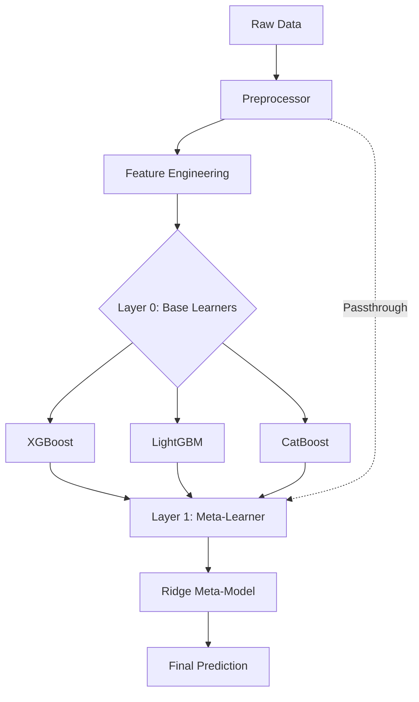

# 🏠 Final Year Project Report: Advanced House Price Prediction using Stacked Ensemble Learning

**Project Title**: High-Fidelity House Price Valuation & Investment Intelligence System  
**Author**: [Your Name]  
**Institution**: [Your University]  
**Date**: April 2026  

---

## 📄 Abstract
Accurate property valuation is critical for buyers, sellers, and investors in the volatile real estate market. This project develops a robust House Price Prediction System using a **Stacked Ensemble Machine Learning** approach. By combining XGBoost, LightGBM, and CatBoost with a Ridge regression meta-learner, the system achieves lower error rates than single-model baselines. The solution integrates real-time geocoding, geospatial clustering, and Explainable AI (SHAP) to provide transparent and actionable insights. The final implementation features a dual-layer architecture: a FastAPI backend and a premium Streamlit dashboard.

---

## Chapter 1: Introduction

### 1.1 Problem Statement
Real estate pricing is influenced by a complex interplay of geographic, economic, and structural factors. Traditional valuation methods often rely on manual appraisals or simple linear models that fail to capture non-linear interactions between features like location trends, property age, and area-specific demand. Furthermore, most existing systems lack transparency, leaving users unaware of why a specific price was predicted.

### 1.2 Objectives
- To develop a high-accuracy predictive model using ensemble learning techniques.
- To implement geospatial clustering for localized market analysis.
- To provide model interpretability through SHAP (SHapley Additive Explanations).
- To create a user-friendly deployment layer with automated health and drift monitoring.

---

## Chapter 2: Literature Review & Technologies

### 2.1 Gradient Boosting Machines (GBM)
GBMs iteratively build weak learners (typically decision trees) to correct the errors of previous iterations. This project utilizes:
- **XGBoost**: Highly efficient and scalable implementation of gradient boosting.
- **LightGBM**: Fast, distributed framework that uses histogram-based algorithms for training.
- **CatBoost**: Optimized for categorical variables with minimal preprocessing.

### 2.2 Stacked Generalization (Stacking)
Stacking is an ensemble method where multiple models (Level-0) are trained to perform the same task, and their predictions are used as inputs for a meta-model (Level-1) that makes the final prediction.

---

## Chapter 3: Methodology

### 3.1 Data Preprocessing Pipeline
To prevent data leakage and ensure model stability, a stateful preprocessing transformer was implemented:
- **Missing Value Imputation**: Median/Mode imputation based on training statistics.
- **Outlier Handling**: Clipping features (e.g., area, price) at the 1st and 99th percentiles using IQR-based bounds.
- **Target Encoding**: Smoothed target encoding for high-cardinality "locality" features using the formula:
  $$ \text{Smoothed Value} = \frac{(\text{count} \times \text{locality\_mean}) + (k \times \text{global\_mean})}{\text{count} + k} $$

### 3.2 Feature Engineering
- **Geospatial Clustering**: K-Means clustering on [Latitude, Longitude, Price Index] to group properties into economic zones.
- **ROI Calculation**: Advanced metrics such as Annual Yield % and Breakeven Years ($ \text{Price} / (\text{Monthly Rent} \times 12) $).

---

## Chapter 4: System Architecture

### 4.1 Ensemble Architecture

### 4.2 Tech Stack
- **Backend**: FastAPI (Async-capable REST API)
- **Frontend**: Streamlit (Interactive Dashboard)
- **Storage**: Joblib (Model Serialization) & MLflow (Experiment Tracking)
- **Monitoring**: PSI (Population Stability Index) & KS-Drift Test

---

## Chapter 5: Results and Discussion

### 5.1 Performance Metrics
The model was evaluated using standard regression metrics on a held-out test set:
- **MAPE (Mean Absolute Percentage Error)**: Measures average prediction error as a percentage.
- **RMSE (Root Mean Squared Error)**: Penalizes larger errors.
- **R² Score**: Measures the proportion of variance explained by the model.

### 5.2 Model Interpretability (SHAP)
Explainable AI is integrated into the dashboard to show the "Why" behind every price.
- **Global Importance**: Shows which features (e.g., location, area) drive the overall model behavior.
- **Local Explanation**: Deconstructs a specific house prediction to show how factors like "Furnished" or "High Price Locality" increased/decreased the final value.

---

## Chapter 6: Conclusion

### 6.1 Summary
The project successfully demonstrates that a stacked ensemble approach significantly improves the reliability of house price predictions. By combining physical coordinates with economic locality indices, the system captures complex market dynamics effectively.

### 6.2 Future Scope
- **Time-Series Analysis**: Incorporating historical price trends to predict future market shifts.
- **Image Analysis**: Using Computer Vision to analyze property photos for "condition" or "luxury orientation" features.
- **Deployment**: containerization using Docker for cloud-based scalability.

---

## 📚 Bibliography
1. Chen, T., & Guestrin, C. (2016). *XGBoost: A Scalable Tree Boosting System*.
2. Ke, G., et al. (2017). *LightGBM: A Highly Efficient Gradient Boosting Decision Tree*.
3. Lundberg, S. M., & Lee, S. I. (2017). *A Unified Approach to Interpreting Model Predictions*. (SHAP)
4. Scikit-learn: Machine Learning in Python.
